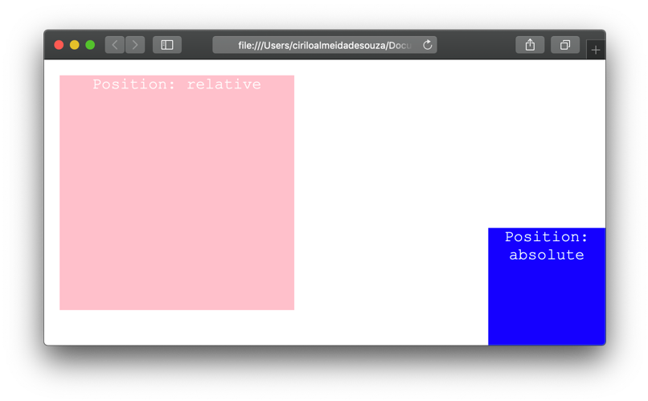

# Position

A propriedade position serve para posicionar um elemento dentro da página web. Ela pode levar em consideração o posicionamento com relação ao tamanho da tela no qual o site está sendo exibido ou com relação ao seu elemento pai.
Para posicionar o elemento na página informamos a distância com relação a parte superior, esquerda, direita ou inferior através das propriedades top, left, right ou bottom.
  
Por padrão todos os elementos HTML têm o posicionamento estático (position: static), não precisamos declarar explicitamente porque o navegador interpreta de forma automática.
  
  
## Posição relativa
Um elemento com posicionamento relativo é posicionado na tela com relação a sua posição original, ou seja, a posição estática. Quando alteramos a sua posição normal, o elemento deixa um buraco que não é preenchido por outros elementos próximos a ele.

```
<style>
  #el1{
      position: relative;
      left: 200px;
  }

  #el2{
      position: static;
  }
</style>
```
  
  

  
  
&nbsp;
  
   
## Posição absolute
O elemento com posição absoluta, leva em consideração a posição do elemento pai.
  
**HTML**

```
<html>
  <body>
      <div id="el1">
          Position relative
          <div id="el2">
              Position absolute
          </div>
      </div>
  </body>
</html>
```

**CSS**

```
<style>
  #el1{
      position: relative;
  }

  #el2{
      position: absolute;
      right: 0;
      bottom: 0;
  }
</style>
```
  
  

  
Se o elemento não tivesse um pai, ele seria posicionado com relação a página web.
  
**HTML**

```
<html>
  <body>
    <div id="el1">
        Position relative
    </div>

    <div id="el2">
        Position absolute
    </div>

  </body>
</html>
```

**CSS**

```
<style>
  #el1{
      position: relative;
  }

  #el2{
      position: absolute;
      right: 0;
      bottom: 0;
  }
</style>
```
  
  


  
  
&nbsp;
  
   
## Position Fixed

O elemento é posicionado de acordo com a tela na qual o website é mostrado. Ele permanece na mesma posição mesmo durante a rolagem da página.
  
**HMTL**

```
<html>
  <body>
      <div id="el1">
          Position relative
      </div>

      <div id="el2">
          Position fixed
      </div>
  </body>
</html>
```

**CSS**


```
<style>
  #el1{
      position: relative;
      top: 500px;
  }

  #el2{
      position: fixed;
      right: 0;
      top: 0;
  }
</style>
```
  


```
<style>
</style>
```

  
  
&nbsp;
  
   
[< Retornar à página principal](../README.md)
  
  
[Ir para a próxima página >](12-Tabelas.md)
