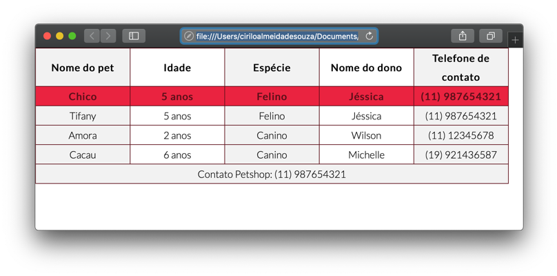
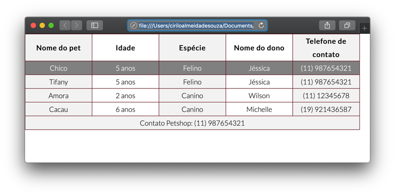

# Estilizando tabela com CSS
  
  
&nbsp;
  
  
Primeiro vamos mudar a fonte da nossa planilha para Montserrat. Vamos baixa-la do Google Fonts e importar para o arquivo CSS através do @import como vimos na sessão Fontes do capítulo [Aplicando estilo com CSS](9-Aplicando-estilo-com-CSS.md).
Através do seletor table, altere a propriedade font-family.

```css
    table{ font-family: 'Lato', sans-serif; }
```
  
  
&nbsp;
  
  
## Pseudo classe
  
  
&nbsp;
  
  
Utilizamos as pseudo classes para definir o estado de um elemento em situações específicas, como por exemplo quando o usuário passa o mouse sobre uma linha da tabela.

### Hover:
A pseudo classe hover atribui um estilo ao elemento quando o usuário passa o mouse sobre ele. Neste caso, quando o usuário passar o mouse sobre a linha da tabela iramos aplicar uma cor de fundo e estilizar a cor da fonte.


```css
  tr:hover{
      background-color: #27d5f5;
      color: #134275
  }
```
  
  


  
  
&nbsp;
  
  
Vamos supor que nós queremos que a nossa tabela tenha um estilo zebrado, onde as linhas ímpares têm um background cinza e as linhas pares branco, como a mostrado aqui embaixo:

```css
  tbody tr:nth-child(odd){
      background-color: #f2f2f2;
  }
```
  
  

  
  
Repare que a segunda, quarta e sexta linhas estão com a cor cinza.
A pseudo classe ntn-child(), seleciona um filho específico de um elemento. Neste caso, informamos ao navegador para pegar os filhos de tbody tr pares, se quisermos as linhas ímpares, é só substituir o parâmetro **odd** por **even**.
Se quisermos somente a quarta linha tenha essa formatação, bastaria inserir o número 4 como parâmetro.

```css
    tbody tr:nth-child(4){
        background-color: #f2f2f2;
    }
```
  
  

  
  
&nbsp;
  
  
### First-child:
A pseudo classe ```first-child```, pega o primeiro filho do elemento especificado. Por exemplo, se quisermos pegar a primeira linha da tabela, podemos combinar dois seletores thead ```tr:first-child```.


```css
    tbody tr:first-child{
      background-color: gray;
      color: white;
    }
```
  
  

  
  
&nbsp;
  
  
As pseudo classes se aplicam a qualquer elemento, não somente tabelas.
Nós veremos mais adiante mais algumas pseudo classes, mas seu você quiser saber mais pode acessar o site do W3C (consórcio internacional que regulamenta e desenvolve padrões para a Web), lá você vai encontrar mais detalhes sobre todas as pseudo classes e como utilizá-las.

Retiramos do site a planilha abaixo. Para acessá-la basta clicar no link ou sobre os nomes das pseudo classes na primeira coluna.
  
  
| Pseudo classe        | Exemplo de uso        | O que faz                                                                                          |
|----------------------|-----------------------|----------------------------------------------------------------------------------------------------|
| :active              | a:active              | Seleciona um link ativo                                                                            |
| :checked             | input:checked         | Seleciona todo elemento de <input> checado                                                         |
| :disabled            | input:disabled        | Seleciona todo elemento de <input> desabilitado                                                    |
| :empty               | p:empty               | Seleciona todo elemento <p> que não tenha filhos                                                   |
| :enabled             | input:enabled         | Seleciona todo elemento de <input> habilitado                                                      |
| :first-child         | p:first-child         | Seleciona o primeiro filho do elemento <p>                                                         |
| :first-of-type       | p:first-of-type       | Seleciona todos os elementos <p> que tenham um outro elemento <p> como pai                         |
| :focus               | input:focus           | Seleciona o elemento <input> que está focado                                                       |
| :hover               | a:hover               | Seleciona um elemento <a> ao passar o mouse sobre ele                                              |
| :in-range            | input:in-range        | Seleciona um elemento <input> cujo o valor esteja dentro de um range específico                    |
| :invalid             | input:invalid         | Seleciona todos os elementos <input> que tenham valores inválidos                                  |
| :lang(language)      | p:lang(it)            | Seleciona todos os elementos <p> que tenham um valor do atributo de linguagem iniciando com "it""" |
| :last-child          | p:last-child          | Seleciona todos elementos <p> que seja os últimos filhos de um elemento pai específico             |
| :last-of-type        | p:last-of-type        | Seleciona todos elementos <p> que sejam os ultimos filhos de um elemento pia específico            |
| :link                | a:link                | Seleciona todos os links não visitados                                                             |
| :not(selector)       | :not(p)               | Seleciona todos os elementos diferente de <p>                                                      |
| :nth-child(n)        | p:nth-child(2)        | Seleciona todos os elementos <p> que são o segundo filho de um elemento pai específico             |
| :nth-last-child(n)   | p:nth-last-child(2)   | Seleciona todos os elementos <p> que seja os penúltimos filhos de um elemento pai específico       |
| :nth-last-of-type(n) | p:nth-last-of-type(2) | Seleciona todos os penúltimos elementos <p> contando a partir do ultimo filho                      |
| :nth-of-type(n)      | p:nth-of-type(2)      | Seleciona o elemento <p> que seja o segundo elemento <p> do seu pai                                |
| :only-of-type        | p:only-of-type        | Seleciona todos os elementos <p. que sejam os únicos elementos <p> do seu pai                      |
| :only-child          | p:only-child          | Seleciona todos os elementos <p> que sejam os unicos filhos do seu pai                             |
| :optional            | input:optional        | Seleciona o elemento <input> sem o atribbuto "required"""                                          |
| :out-of-range        | input:out-of-range    | Seleciona o elemento <input. Com o valor fora do range especificado                                |
| :read-only           | input:read-only       | Seleciona o elemento <input> com o atributo "readonly"""                                           |
| :read-write          | input:read-write      | Seleciona o elemento <input> sem o atributo "readonly"""                                           |
| :required            | input:required        | Seleciona o elemento <input> com o atribbuto "required"""                                          |
| :root                | root                  | Seleciona o elemento raiz do documento                                                             |
| :target              | #news:target          | Seleciona o elemento com o id #news (ao ser clicado)                                               |
| :valid               | input:valid           | Seleciona todos os elementos <input> com valores válidos                                           |
| :visited             | a:visited             | Seleciona todos os links visíveis                                                                  |
[Link W3Schools](Link: https://www.w3schools.com/css/css_pseudo_classes.asp)
  
  
&nbsp;
  
  
Vamos finalizar a aplicação um estilo ao cabeçalho e rodapé da tabela.
  
  
```css
    thead, tfoot{
        background-color: #d3d3d3;
        font-family: 'Open Sans', sans-serif;
        font-weight: 700;
        background-color: #dd213c;
        color: #fff;
    }
```
  
  

  
  
&nbsp;
  
  
## Onde não usar tabelas
  
  
&nbsp;
  
  
As tabelas foram criadas para tabulação de dados e somente isto! Antigamente era muito comum criar sites utilizando tabelas, este é um mal exemplo de uso pois os desenvolvedores utilizavam porque era mais fácil posicionar os elementos dentro das páginas web, isso resultava em um código de difícil legibilidade e difícil manutenção.
  
  
&nbsp;
  
  
[< Retornar à página principal](../README.md)
  
  
[Ir para a próxima página >](14-Formulários.md)
