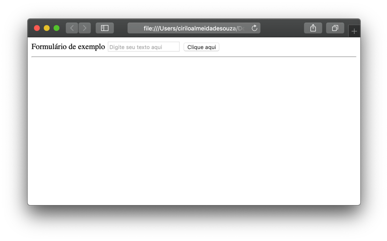
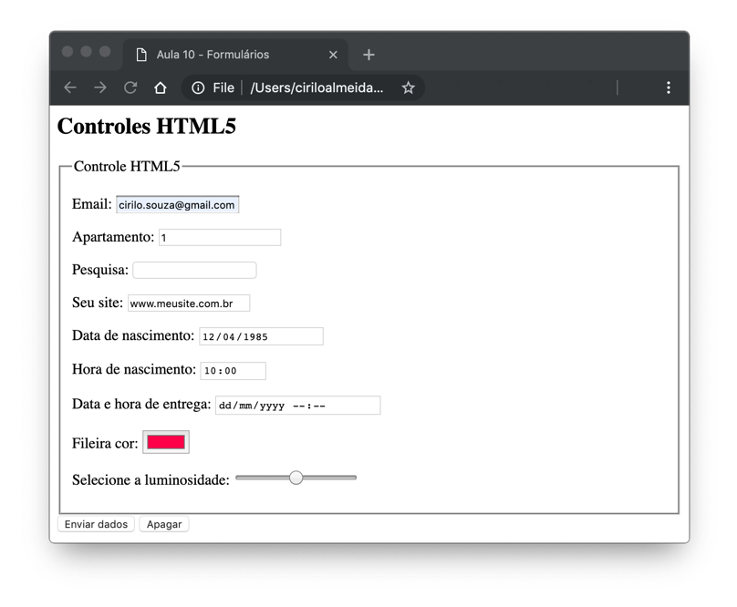

# Formulários
  
  
&nbsp;
  
   
 A Web está cheia de formulários, seja uma página de login, um cadastro, uma página de contatos, tudo isso são formulários! E saber como manusear eles é um diferencial para quem quer trabalhar como Web Designer ou Frontend Developer (*a propósito esta é uma área que cresce a cada dia e está escassa de bons profissionais, portanto #ficaadica*). 
Neste capítulo daremos uma introdução aos Web Forms como são chamados e como estiliza-los através do CSS. 
  
  
&nbsp;
  
   
 ## O que são os web forms?
   
  
&nbsp;
  
   
 Os formulários são uma das principais formar de interação do publico alvo com o site. Através deles os usuários conseguem enviar mensagens, fazer cadastro, login, etc. 
   
Porém os formulários são o elo mais fraco no ponto de vista de segurança, isso porque alguns desenvolvedores frontend descuidados não tomam o devido cuidado durante o desenvolvimento e acabam deixando o site vulnerável a ataques.
  
Outro ponto muito importante para ficarmos atentos é com relação a usabilidade do formulário.

*Usabilidade? Oi? Isso aí… Essa palavra é nova! *

Um formulário que gere uma boa experiência para o usuário garante que o usuário complete ele sem maiores atritos, ou seja, sem dor para o usuário! Este é outro ponto muitas vezes negligenciado pelos desenvolvedores, que enchem os formulários com campos aparentemente desnecessários. 

*Vai dizer que você nunca teve que preencher um formulário de cadastro que parecia interminável?
Ou foi obrigado a fazer um cadastro e contar toda sua vida só para comprar um ingresso para o cinema?*

Aqui o planejamento se torna essencial, desenhe antes o formulário e questione-se ou questione os demandantes do projeto sobre quais campos serão solicitados no formulário e se eles são realmente necessários. Tenha sempre em mente que menos é mais.
  
  
&nbsp;
  
   
 ## Estrutura do formulário
   
  
&nbsp;
  
   
 Todos os formulários começam com o elemento \<form\>, ele define o início. Já o final é definido pelo elemento \</form\>. Assim como qualquer elemento HTML o \<form\> possui atributos como por exemplo o ```action``` e o ```method```.
  
  
&nbsp;
  
   
 ### Atributo action:
 
 O action define para onde os dados coletados pelo <form> serão enviados, seu valor deve ser uma URL para um servidor web que executará alguma ação de acordo com o valor recebido.
  
  
&nbsp;
  
   
 ### Atributo method:
 
 O atributo method pode conter os valores ```GET```, ```POST```, ```PUT```, ```DELETE``` ou ```PATCH```. O ```GET``` é responsável coletar os dados, sua solicitação e os parâmetros são passados no cabeçalho da requisição ficando visível na barra de endereço do navegador. 
 

  
  
&nbsp;
  
   
 Já o método ```POST```, é responsável por enviar os dados para o servidor, como os campos de usuário e senha por exemplo. Os dados não ficam visíveis na barra de endereço do navegador. 
Se quisermos atualizar os dados, podemos utilizar o ```PUT```, que substitui todas as informações de um determinado recurso, por exemplo um produto. Para deletar recursos utilizamos o ```DELETE``` e para atualizar as informações utilizamos o ```PATCH```.
  
  
O nosso código ficaria desta forma:

```html
    <form action="/cadastro.html" method="POST">
    	  Conteúdo do formulário aqui
    </form>
```
  
  
&nbsp;
  
   
 ## Criando um formulário
  
  
&nbsp;
  
   
 ### Elemento Label:
 
 O elemento \<label\> cria um pequeno texto, geralmente é utilizado antes dos elementos de \<input\> como descrição do campo, o atributo for indica a qual \<input\> aquele \<label\> pertence de acordo com o seu atributo id.
 
 ```html
    <form action="/cadastro.html" method="POST">
        <label for="rdf">Feminino</label>
        <input type="radio" name="genero" value="F" id="rdf">

        <label for="rdm">Masculino</label>
        <input type="radio" name="genero" value="M" id="rdm">
    </form>
```
  
  
&nbsp;
  
   
### Elemento Input:

O \<input\> é o elemento mais importante do formulário, serve para entrada de dados e também pode conter atributos que estendem suas funcionalidades.
  
  
  * Atributo type: Aqui temos alguns valores que podemos colocar no atributo type
  
| Valor          | Descrição                                                                                                                    |
|----------------|------------------------------------------------------------------------------------------------------------------------------|
| button         | Cria um botão clicável.                                                                                                      |
| checkbox       | Cria um capo de checkbox onde múltiplas opções podem ser selecionadas.                                                       |
| color          | Cria um color picker (selecionador de cores).                                                                                |
| date           | Cria um controle de data (dia – mês – ano).                                                                                  |
| datetime-local | Cria um controle de horas (dia – mês – ano – horas).                                                                         |
| email          | Cria um campo de email onde é obrigatório inserir o @.                                                                       |
| file           | Cria um campo de seleção de arquivo.                                                                                         |
| hidden         | Define o campo como oculto.                                                                                                  |
| image          | Define uma imagem como botão de submit (enviar).                                                                             |
| month          | Cria um campo de mês.                                                                                                        |
| number         | Cria um campo onde os únicos valores permitidos são números.                                                                 |
| password       | Cria um campo de senha. A senha fica oculta e é substituída por asteriscos.                                                  |
| radio          | Cria um campo de seleção radio onde somente uma opção pode ser selecionada.                                                  |
| range          | Cria um campo parecido com um slider.                                                                                        |
| reset          | Cria um botão de reset (limpa todas as informações preenchidas no formulário).                                               |
| search         | Cria um campo de busca.                                                                                                      |
| submit         | Define um botão de submit (enviar).                                                                                          |
| tel            | Cria um campo onde é possível inserir números de telefones.                                                                  |
| text           | É o atributo padrão do type, se nenhum outro atributo for informado o formulário assumirá que se trata de um campo de texto. |
| time           | Cria um campo de controle de horas.                                                                                          |
| url            | Cria um campo de URL.                                                                                                        |
| week           | Cria um campo de controle de semanas.                                                                       
  
  

```html
    <form action="/cadastro.html" method="POST">
        <label for="Formulário de exemplo">Formulário de exemplo</label>
 <!-- Cria um campo de texto -->
        <input placeholder="Digite seu texto aqui">

<!-- Cria um botão com o texto "Clique aqui" -->
        <input type="button" value="Clique aqui" id="btn">
    </form>
```
  
  
 
   
  
&nbsp;
  
   
### Atributo size: 

O atributo size serve para configurarmos a quantidade de caracteres aceitas pelo \<input\>. Atualmente controlamos o size através de CSS mas em alguns casos você poderá dar manutenção em um código antigo.

### Atributo name:

Quando enviamos os dados do formulário para o servidor, geralmente uma linguagem de programação como o Javascript está por trás no servidor e irá capturar esses dados para trata-los antes de enviar para um banco de dados. Para trata-los ela precisará saber algo que identifica a origem daquele dado, para isso utilizamos o atributo name.  

### Atributo placeholder:

O atributo placeholder cria um valor padrão de preenchimento do input, muitos desenvolvedores utilizam o placeholder como uma dica de como aquele campo deve ser preenchido.

### Elemento Fildset:
Você pode agrupar elementos que façam parte do mesmo contexto utilizando o \<fildset\>, como por exemplo agrupar campos de endereço em um formulário.

```html
    <h2>Formulario com fieldset</h2>
    <form action="/cadastro.html" method="POST">
      <label>Formulário de Cadastro</label>
      <fieldset>
        <p>
          <label for="street">Endereço</label>
          <input type="text" name="street" id="street">
        </p>
        <p>
          <label for="number">N.</label>
          <input type="number" name="numebr" id="number">
        </p>        
        <p>
          <label for="neighborhood">Bairro</label>
          <input type="text" name="neighborhood" id="neighborhood">
        </p>        
        <p>
          <label for="zipcode">CEP</label>
          <input type="number" name="zipcode" id="zipcode">
        </p>  
        <p>
          <label for="city">Cidade</label>
          <input type="text" name="city" id="city">
        </p>   
        <p>
          <label for="state">Estado</label>
          <input type="text" name="state" id="state">
        </p>
      </fieldset>
      <input type="submit" name="send" value="Enviar" id="send">
    </form>	
```
  
  

  
  
&nbsp;
  
   
Podemos utilizar também o elemento <legend> em conjunto com o \<fildeset\> para dar um nome para aquele conjunto de campos.

```html
    <h2>Formulário com Legend</h2>
    <form id="dados" method="post" action="">
      <fieldset> <!--traça uma borda-->
        <legend>Dados de Acesso</legend> <!--separa em blocos-->
        <p>
        <label for="nome" > Nome: </label>
        <input type="text" id="nome" placeholder="Seu nome completo" required autofocus /> <!--Input type: tipo da entrada, placeholder: exemplo de preenchimento-->
        </p>

        <p>
        <label for="usuario"> Usuário: </label>
        <input type="text" id="usuario" placeholder="Seu usuário" required /> 
        </p>

        <p>
        <label for="senha"> Senha: </label>
        <input type="password" id="senha" placeholder="Sua senha" maxlength="5" required /> 
        </p>

      </fieldset>
    </form>
```
  
  
&nbsp;
  
   

  
  
&nbsp;
  
   
```html
    <form id="dados" method="post" action="">
      <fieldset>
          <legend>Dados pessoais</legend>
          <p>
              <label for="formacao">Formação:</label>
              <select id="formacao">
                  <option value="-1">Selecione uma opção</option>
                  <option value="Ensino Fundamental">Ensino Fundamental</option>
                  <option value="Ensino Médio">Ensino Médio</option>
                  <option value="Graduação">Graduação</option>
                  <option value="MBA">MBA</option>
                  <option value="Mestrado">Mestrado</option>
                  <option value="Doutorado">Doutorado</option>
              </select>
          </p>

          <p>
              <label for="sexo">Sexo:</label>
              <input type="radio" name="sexo" value="masculino" id="masc" />
              <label for="masc"> Masculino </label> 
              <input type="radio" name="sexo" value="feminino" id="fem"/> 
              <label for="fem"> Feminino </label>
          </p>

          <p>
              <label for="preferencias">Preferências:</label>
              <input type="checkbox" name="praia" value="praia" id="praia" checked/> 
              <label for="praia">Praia</label> <!--clicar na palavra pra selecionar-->
              <input type="checkbox" name="selva" value="selva"/> Selva
              <input type="checkbox" name="campo" value="campo"/> Campo
              <input type="checkbox" name="montanha" value="montanha"/> Montanha
          </p>

          <p>
              <label for="coment">Comentários</label><br/>
              <textarea placeholder="Fala ai rapaz"></textarea>
          </p>

          </p>
              <label for="arquivos">Enviar arquivos</label><br/>
              <input type="file" id="arquivos"/>  
          </p>
      </fieldset>
    </form>
```
  
  

  
  
&nbsp;
  
   
```html
    <form action="">
      <fieldset> 
        <legend>Controle HTML5</legend> 
        <p>
          <label for="email">Email:</label>
          <input type="email" id="email" required />
        </p>
        <p>
          <label for="apartamento">Apartamento:</label>
          <input type="number" id="apartamento" required />
        </p>

        <p>
          <label for="buscar">Pesquisa:</label>
          <input type="search" id="buscar" required />
        </p>

        <p>
          <label for="site">Seu site:</label>
          <input type="url" id="site" required />
        </p>

        <p>
          <label for="nascimento">Data de nascimento:</label>
          <input type="date" id="nascimento" required />
        </p>

        <p>
          <label for="hora">Hora de nascimento:</label>
          <input type="time" id="hora" required />
        </p>

        <p>
          <label for="entrega">Data e hora de entrega:</label>
          <input type="datetime-local" id="entrega" required />
        </p>

        <p><!-- renderiza a paleta de cores do seu sistema -->
          <label for="fileira">Fileira cor:</label>
          <input type="color" id="fileira" required />
        </p>

        <p><!-- cria escala de valores -->
          <label for="escala">Selecione a luminosidade:</label>
          <input type="range" id="escala" min="10" max="20" step="5" required />
        </p>
      </fieldset>
      <input type="submit" value="Enviar dados">
      <input type="reset" value="Apagar">
     </form>
```
  
  

  
  
&nbsp;
  
   
[< Retornar à página principal](../README.md)
  
  
[Ir para a próxima página >](15-Elementos-semânticos.md)
