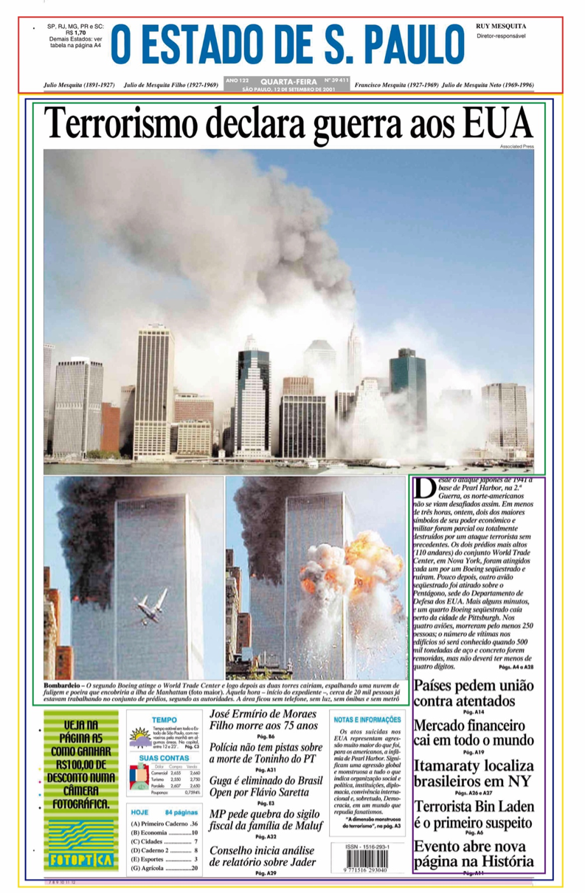
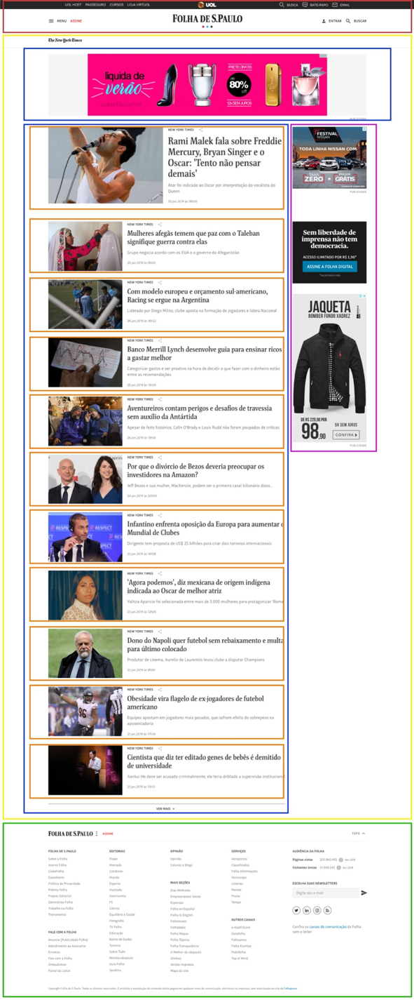

# Elementos semânticos
  
  
&nbsp;
  
  
Encontramos milhares de páginas Web, cheias de efeitos visuais e com diferentes estilos. Porém, todas elas compartilham (ou pelo menos deveriam compartilhar) a mesma estrutura de elementos HTML. O HTML 5 introduziu o conceito de elementos semânticos que estruturam uma página Web como se fosse um jornal.
  
  

  
  
&nbsp;
  
  
Repare que segue a mesma estrutura.

  
  
Nas versões anteriores ao HTML 5 toda estrutura das páginas web eram divididas utilizando o elemento \<div\>. O HTML 5 introduziu elementos específicos para corrigir de forma clara o papel desempenhado por cada elemento. Essas informações explícitas ajudam os robôs do Google e o Bing, a entender melhor qual conteúdo é importante e qual é secundário.
  
  
&nbsp;
  
  
### Header:

A parte do topo em vermelho da imagem anterior é o \<header\>, é uma área nobre do site, pois, é à primeira vista pelo usuário. Geralmente são colocados cabeçalhos, logos e menus. 
Ele pode indicar o inicio de um documento HTML ou de uma sessão.

```html
<!-- Início da página -->
<header>
    <nav>
        <ul>
            <li><a href="#">Item 1</a></li>
            <li><a href="#">Item 2</a></li>
        </ul>
    </nav>
</header>
```

```html
<!-- Início da sessão -->
<article>
     <section>
          <header>
                <h1>Cabeçalho do meu artigo</h1>
          </header>
                <p>
                    Lorem ipsum …
                </p>
     </section>
</article>
```
  
  
&nbsp;
  
  
### Navigation bar:

O \<nav\> são links de navegação do site que pode direcionar o usuário para páginas específicas dentro do site, para sessões dentro da própria página ou para sites externos.

```html
<nav>
    <ul>
        <li><a href="#">Item 1</a></li>
        <li><a href="#">Item 2</a></li>
    </ul>
</nav>
```
  
  
&nbsp;
  
  
### Main:

A parte amarela do site é o \<main\> é uma grande área central onde a maior parte do conteúdo principal do site fica alocado. Podemos ter vídeos, imagens, textos, gráficos, etc. 

```html
<main>
    <article>
        <section>
            <header>
                <h1>Cabeçalho do meu artigo</h1>
            </header>
            <p>
                Lorem …
            </p>
        </section>
    </article>
</main>
```
  
  
&nbsp;
  
  
### Side bar:

Colocamos aqui um conteúdo secundário, muitos sites utilizam o \<aside\> para mostrar propagandas aos visitantes, que é o caso do site que vimos anteriormente. Mas pode se tratar de uma notícia secundária, ou um perfil de alguém que escreveu a própria notícia.

```html
<aside>
    
</aside>
```
  
  
&nbsp;
  
  
### Footer:

Localizado na parte inferior do site ou da sessão, o objetivo do \<footer\> é mostrar os dados sobre o autor da página ou artigo, termos de copyright, contatos, endereços, etc. 

```html
<!-- Final da página -->
<footer>
    <p>Contato: (11) 912349567</p>
    
</footer>

  
  
&nbsp;
  
  
[< Retornar à página principal](../README.md)
  
  
[Ir para a próxima página >](16-Um-pouco-mais-de-HTML.md)
