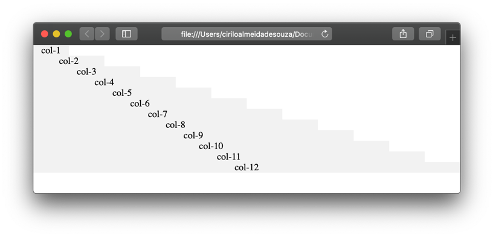

# Construindo um sistema de grid


Antes de começar temos que garantir que todos os elementos da página tenham a propriedade box-sizing=”border-box”.

```css
*{
    box-sizing: border-box;
}
```
  
  
Feito isso, nós fazemos um cálculo para saber o tamanho de uma coluna (100% / 12) = 8.333%, se uma coluna equivale a 8.333%, para sabermos o valor de 2 colunas basta multiplicar o resultado por 2, ou seja, duas colunas equivalem a 16.666% e assim por diante. Veja como ficaria um arquivo CSS. 

```css
.col-1{ 
    width: 8.333333%;
    max-width: 8.333333%;
 }

.col-2{ 
    width: 16.666667%;
    max-width: 16.666667%;
 }

.col-3{ 
    width: 25%;
    max-width: 25%;
 }

.col-4{ 
    width: 33.333333%;
    max-width: 33.333333%;
 }

.col-5{ 
    width: 41.666667%;
    max-width: 41.666667%;
 }

.col-6{ 
    width: 50%;
    max-width: 50%;
 }

.col-7{ 
    width: 58.333333%;
    max-width: 58.333333%;
 }

.col-8{ 
    width: 66.666667%;
    max-width: 66.666667%;
 }

.col-9{ 
    width: 75%;
    max-width: 75%;
 }

.col-10{ 
    width: 83.333333%;
    max-width: 83.333333%;
 }

.col-11{ 
    width: 91.666667%;
    max-width: 91.666667%;
 }

.col-12{ 
    width: 100%;
    max-width: 100%;
 } 
```
  
  

  
  
&nbsp;
  
  
Da forma que configuramos, as colunas serão exibidas sempre uma abaixo da outra, isso faz sentido quando um elemento ocupa 12 colunas, mas e quando queremos que os elementos fiquem um ao lado do outro, cada um ocupando 6 colunas por exemplo?
Podemos fazer isso utilizando o float (que já vimos anteriormente) ou o Flex-box (que veremos daqui a pouco).
  
  
### CSS – Com float:

```css
[class*="col-"]{
    float: left;
}
```
  
  
### CSS – Com Flex-Box

```css
.row{
    display: -ms-flexbox;
    display: flex;
    flex-wrap: wrap;
}
```
  
  


  
  
&nbsp;
  
  
Os dois fazem praticamente a mesma coisa, mas trabalhar com Flex-box é muito mais fácil do que se trabalhar com float. Repare que com o Flex-box, nós criamos uma nova classe chamada .row  e aplicamos o estilo a ela e não às colunas como fizemos com o float.
Nós criamos a classe row, porque cada novo item da página será mostrado em uma nova linha, as linhas devem aparecer uma abaixo da outra.

```html
<!DOCTYPE html>
<html lang=”pt-br”>
<head>
    <meta charset=”UTF-8”>
    <meta name=”viewport” content=”width=device-width, initial-scale=1.0”>
    <link rel=”stylesheet” href=”grid.css”>
    <link rel=”stylesheet” href=”exemplo-grid.css”>
    <title>Exemplo de Grid</title>
</head>
<body>
    <header class=”row”>
        <nav class=”col col-12 menu”>
            <ul>
                <li><a href=”#”>Item 1</a></li>
                <li><a href=”#”>Item 2</a></li>
                <li><a href=”#”>Item 2</a></li>
            </ul>
        </nav>
    </header>
    <main class=”row”>
        <aside class=”col col-3 aside”>
            <h2>Aside</h2>
            <p>
                Lorem ipsum dolor sit amet consectetur adipisicing elit. Dolorem quibusdam fugiat nulla veniam nemo quod assumenda eligendi nostrum a illo incidunt
            </p>
        </aside>
        <section class=”col col-9 main”>
            <h1>Conteúdo principal</h1>
            <p>
                Lorem ipsum dolor sit amet consectetur adipisicing elit. Dolore quidem esse in ad vero, quam labore asperiores fugiat, sapiente blanditiis sequi  ommode, tempore aspernatur impedit veniam pariatur ab non eveniet.
            </p>
        </section>
    </main>
    <footer class=”row”>
        <section class=”col col-12 footer”>
            <h2>Footer</h2>
        </section>
    </footer>
</body>
</html>
```
  
  
Desta forma, somente com linhas e colunas conseguimos criar um layout responsivo.
  
  

  
  
&nbsp;
  
  
[< Retornar à página principal](../README.md)
  
  
[Ir para a próxima página >](20-Media-Queries.md)
