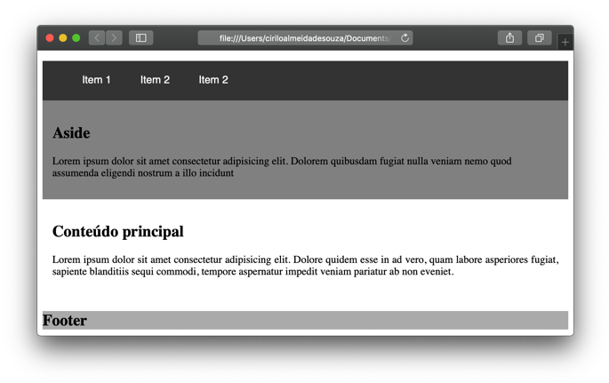
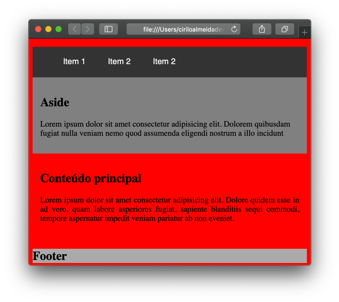
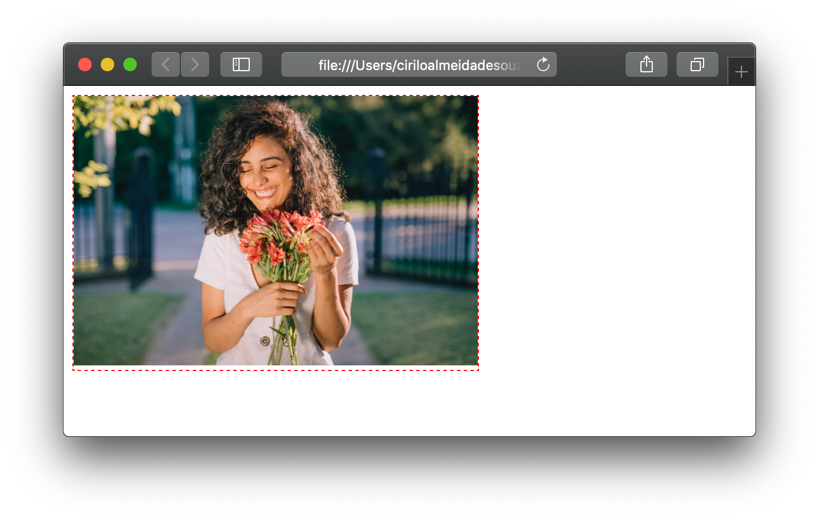

# Media Queries


O media query foi inserido no CSS3, e através dele criamos regras onde informamos ao navegador quais configurações devem ser aplicadas quando uma condição for verdadeira.

```css
@media screen and (min-width: 500px) and (max-width: 800px){
    body{
        background-color: red;
    }
}
```

No exemplo acima, nós falamos ao navegador que quando o tamanho mínimo da tela for 500px (min-width: 500px) e o tamanho máximo for 800px (max-width: 800px) ele aplicará uma cor de fundo vermelha no elemento body (body{backgound-color: red;}).  Mas esta configuração só será aplicada quando o tamanho da tela estiver entre 500px e 800px, fora isso, será mantido o padrão aplicado anteriormente.
  
  
Tela maior que 800px

  
  
Tela entre 500px e 800px
 
  
  
Você pode adicionar tantos breakpoints quanto forem necessários, inserimos breakpoints para dispositivos mobile, tablets e notebooks e dispositivos grandes.
Abaixo, temos uma relação dos breakpoints mais utilizados. O grid que criamos agora a pouco será replicado para dentro de cada um dos media queries, porque queremos que as nossas páginas também utilizem o sistema de grid nos dispositivos mobile. 

```css
/* Dispositivos muito pequenos (smartphones, menores que 600px) */
@media only screen and (max-width: 600px) {} 

/* Dispositivos pequenos (tablets no formato retrato, smartphones grandes, maiores que 600px ) */
@media only screen and (min-width: 600px) {} 

/* Dispositivos médios (tablets no formato paisagem, maiores que 768px) */
@media only screen and (min-width: 768px) {} 

/* Dispositivos grandes (laptops/desktops, maiores que 992px) */
@media only screen and (min-width: 992px) {} 

/* Dispositivos extra grandes (laptops grandes, desktops, maiores que 1200px) */
@media only screen and (min-width: 1200px) {}
```
  
  
Imagine que as colunas podem ocupar tamanhos diferentes em cada um destes dispositivos, para isso, precisaremos alterar o nome das classes. Para dispositivos muito pequenos (até 600px), o nome da classe será .col-xs-número, para dispositivos pequenos, .col-sm-número, para dispositivos médios, .col-md-número,  para dispositivos grandes, .col-lg-número e para dispositivos extra grandes .col-xl-número.

```css
@media only screen and (max-width: 600px) {
    .col-xs-1{ 
        width: 8.333333%;
        max-width: 8.333333%;
     }
}

@media only screen and (min-width: 600px) {
    .col-sm-1{ 
        width: 8.333333%;
        max-width: 8.333333%;
     }
}

@media only screen and (min-width: 768px) {
    .col-md-1{ 
        width: 8.333333%;
        max-width: 8.333333%;
     }
}

@media only screen and (min-width: 992px) {
    .col-lg-1{ 
        width: 8.333333%;
        max-width: 8.333333%;
     }
}

@media only screen and (min-width: 1200px) {
    .col-xl-1{ 
        width: 8.333333%;
        max-width: 8.333333%;
     }
}
```

Colocamos apenas um exemplo de classe, você deve colocar as 12 classes de colunas para cada um dos breakpoints.
  
  
&nbsp;
  
  
### Orientação:
  
  
&nbsp;
  
  
O media query também pode verificar a orientação na qual o dispositivo está sendo usado, se no formato retrato (em pé) ou no formato paisagem (deitado).

```css
@media only screen and (min-width: 600px) and (orientation: landscape){}
```
  
  
&nbsp;
  
  
## Imagens responsivas
  
  
&nbsp;
  
  
Sabe aqueles valores em PX que usamos para as imagens até agora? Esquece! Uma imagem pode ser exibida desde um relógio até uma TV 4k, elas ficam legais na tela de um computador, agora imagina usar um valor fixo em PX e mostrar a mesma imagem em um smartphone (provavelmente você teria que dar um scroll lateral para ver a imagem toda) ou em uma TV 4k (provavelmente ela ficaria pequena demais na tela). Então para resolver isso, nós usamos valores relativos em ( % ) porcentagem. Desta forma, independente do tamanho da janela essa imagem sempre ocupará a porcentagem definida.

```html
    <section class="row">
        <section class="col-12">
            
        </section>
    </section>
```

```css
section{
    width: 60%;
    border: 1px dashed red;
}

img{
    width: 100%;
    max-width: 100%;
}
```
  
  


  
  
&nbsp;
  
  
## Imagens diferentes para dispositivos diferentes:
  
  
&nbsp;
  
  
Uma imagem grande por ficar legal em um dispositivo grande. Agora imagine redimensionar esta imagem para que ela apareça em um smartphone, isso além de comprometer sua qualidade, obriga o usuário a baixar uma imagem pesada utilizando o 4g (vamos pensar no nosso usuário né?).
Por isso, podemos usar o media query para carregar imagens de tamanhos diferentes para cada um dos breakpoints que utilizamos no nosso site.

```css
body{
    background-image: url('crianca.jpg');
    background-size: contain;
    background-repeat: no-repeat;
}

@media screen and (max-width: 599px) {
    body{
        background-image: url('crianca-600px.jpg');
    }
} 

@media screen and (min-width: 600px) and (max-width: 767px) {
    body{
        background-image: url('crianca-768px.jpg');
    }
} 
```


  
  

  
  


  
  
&nbsp;
  
  
[< Retornar à página principal](../README.md)
  
  
[Ir para a próxima página >](21-Facilitando-a-vida-com-flexbox.md)
