# Facilitanto a vida com Flexbox
  
  
&nbsp;
  
  
A especificação Flexbox foi introduzida ao CSS3 em 2017, o seu objetivo é fornecer uma forma mais eficiente de criar layout de páginas web independentemente do dispositivo no qual ela será visualizada, por isso o nome Flex.  
Antes para que um elemento fosse posicionado na tela, utilizávamos tipos de layout com float, position, block e inline-block, isso fazia com que os elementos fossem posicionados de acordo com a estrutura da página HTML, o que era um trabalho que demandava muito tempo e manutenção. Hoje com o Flexbox, posicionamos estes elementos de forma rápida e fácil.
A ideia principal por trás do Flexbox é permitir que os elementos sejam ajustados e posicionados para caberem em qualquer tela, ao contrário do float, ele não depende da estrutura do HTML e pode posicionar os elementos onde for necessário dentro da página.
  
  
&nbsp;
  
  
## Flex-flow 
  
  
&nbsp;
  
  
Um layout padrão apresenta os elementos em forma de bloco ou em forma de linha, um layout flex, utiliza o que chamamos de “flex-flow directions”, ou seja, as direções também são flexíveis.
O flex-container possui dois eixos o horizontal ***main eixis*** e o vertical ***cross eixis***, os itens serão alinhados de acordo com estes eixos na horizontal, a partir do ***main-start*** para o ***main-end***, ou do ***cross-start*** para o ***cross-end***.
  
  

  
  
&nbsp;
  
  
## Flex-container 
  
  
&nbsp;
  
  
Um Flex-container é o elemento principal da estrutura do Flexbox, as principais configurações são aplicadas a ele e os filhos (flex-item) apenas as herdam. 
Para que um container seja um flex-container, utilizamos no nosso arquivo CSS a propriedade display: flex no seletor do container.

```css
.container{
    display: -webkit-box;      /* OLD - iOS 6-, Safari 3.1-6 */
    display: -moz-box;         /* OLD - Firefox 19- (buggy but mostly works) */
    display: -ms-flexbox;      /* TWEENER - IE 10 */
    display: -webkit-flex;     /* NEW - Chrome */
    display: flex;             /* NEW, Spec - Opera 12.1, Firefox 20+ */	
}
```
  
  
&nbsp;
  
  
### Flex-direction:

O flex-direction define qual será a direção na qual os flex itens serão mostrados na tela, se na horizontal (main axis) ou na vertical (cross axis).
Os valores podem ser as seguintes:
* row: Escrita padrão da esquerda para direita;
* row-reverse: Escrito da direita para a esquerda;
* column: Escrito de cima para baixo;
* column-reverse: escrito debaixo para cima;
  
  
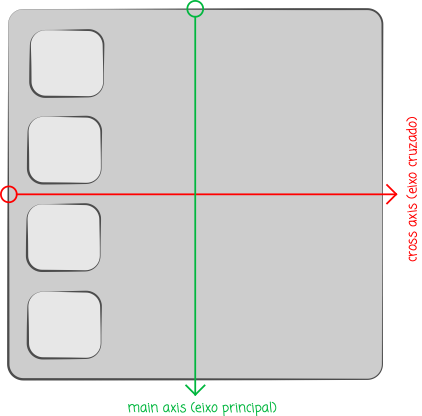
  
  
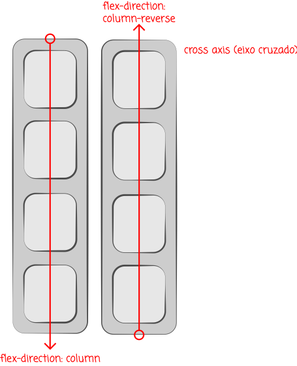
  
  
#### HTML
  
```html
<h2>Flex-direction: row</h2>
<article class="container">
    <section class="row">
        <div>
            <h2>1</h2>
        </div>
        <div>
            <h2>2</h2>
        </div>
        <div>
            <h2>3</h2>
        </div>
        <div>
            <h2>4</h2>
        </div>
    </section>
</article>
```
  
  
#### CSS

```css
.row{ 
    display: flex;
    flex-direction: row;
    width: 100%; 
}
```
  
   


  
  
&nbsp;
  
  
```css
.row-reverse{ 
    display: flex;
    flex-direction: row-reverse; 
}
```
  
  
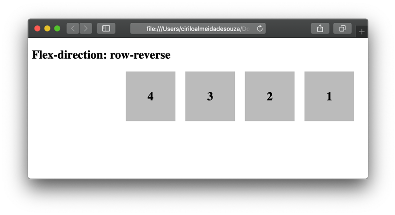
  
  
&nbsp;
  
  
```css
.column{ 
    display: flex;
    flex-direction: column; 
}
```
  
   
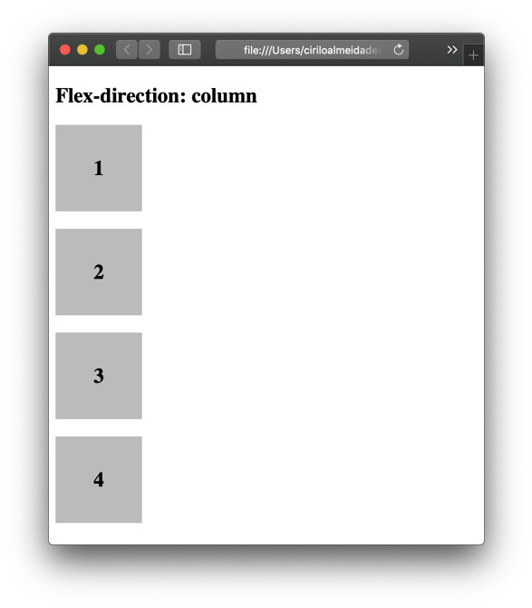

  
  
&nbsp;
  
  
```css
.column-reverse{ 
    display: flex;
    flex-direction: column-reverse; 
}
```
  
  

  
  
&nbsp;
  
  
Como o Flexbox é relativamente novo, alguns browsers não oferecem suporte para suas propriedades, neste caso é necessário usar propriedades especiais.

```css
.container{
    display: -webkit-box;      /* OLD - iOS 6-, Safari 3.1-6 */
    display: -moz-box;         /* OLD - Firefox 19- (buggy but mostly works) */
    display: -ms-flexbox;      /* TWEENER - IE 10 */
    display: -webkit-flex;     /* NEW - Chrome */
    display: flex;             /* NEW, Spec - Opera 12.1, Firefox 20+ */
}
```
  
  
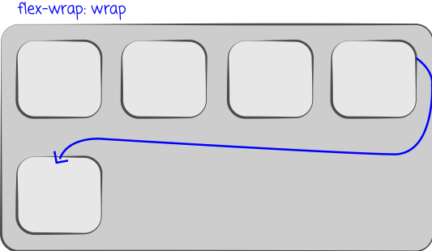
  
  
```css
.wrap{ flex-wrap: wrap; }
```
  
  
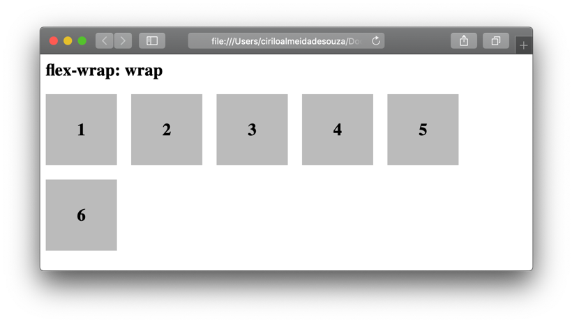
  
  
&nbsp;
  
  
Para que todos os itens sejam exibidos em uma única linha, utilizamos o valor nowrap.
  
  

  
  
&nbsp;
  
  
Podemos inverter a ordem na forma como o item será realocado dentro da tela, a propriedade flex-wrap: wrap-reverse irá realocar o item acima.

```css
.wrap-reverse{ flex-wrap: wrap-reverse; }
```
  
  
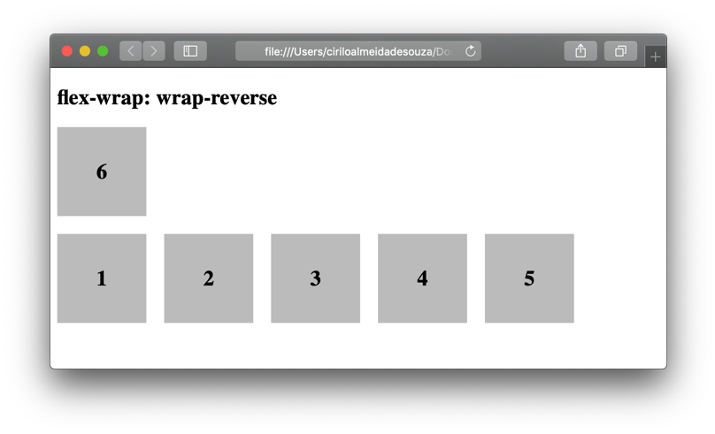
  
  
&nbsp;
  
  
### Justify-content:

O justify-content alinha os itens no main axis (eixo principal - horizontal). Isso ajuda a distribuir os itens dentro dos espaços em branco dentro da página.
  
  
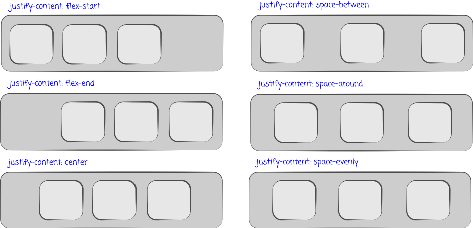
  
  
&nbsp;
  
  
A propriedade justify-content: flex-start, alinha os itens a esquerda (main start)

```css
.justify-content-start{ justify-content: flex-start; }
```
  
  
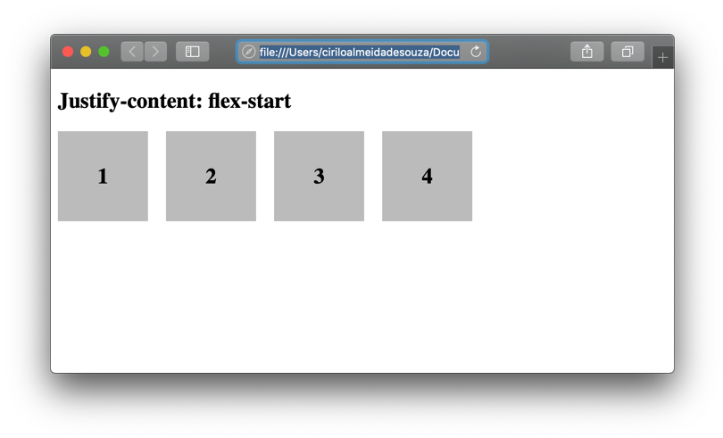
  
  
&nbsp;
  
  
A propriedade justify-content: flex-end alinha os itens a direita.

```css
.justify-content-end{ justify-content: flex-end; }
```
  
  
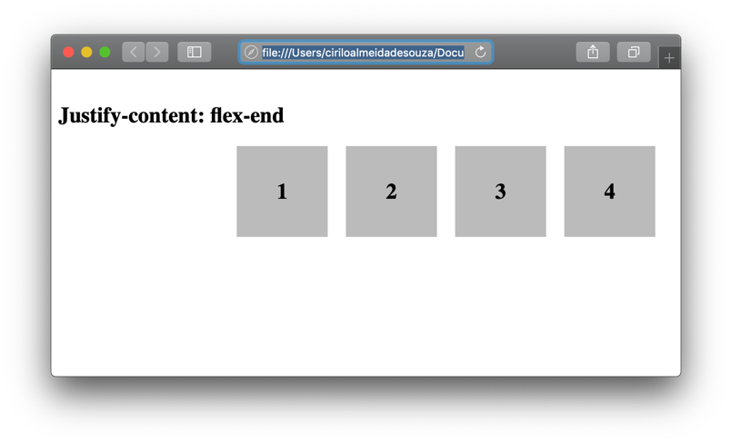
  
  
&nbsp;
  
  
A propriedade justify-content: center, alinha os itens ao centro.

```css
.justify-content-center{ justify-content: center; }
```
  
  

  
  
&nbsp;
  
  
A propriedade justify-content: space-between, distribui os elementos com o espaçamento igual entre eles. O primeiro item fica localizado no inicio da linha (main start) e o ultimo no final da linha (main end).

```css
.justify-content-between{ justify-content: space-between; }
```
  
  

  
  
&nbsp;
  
  
A propriedade justify-content: space-around, distribui os elementos uniformemente dentro da linha.

```css
.container12{
    display: flex;
    flex-direction: row;
    flex-wrap: wrap;
    justify-content: space-around; 
}
```
  
  
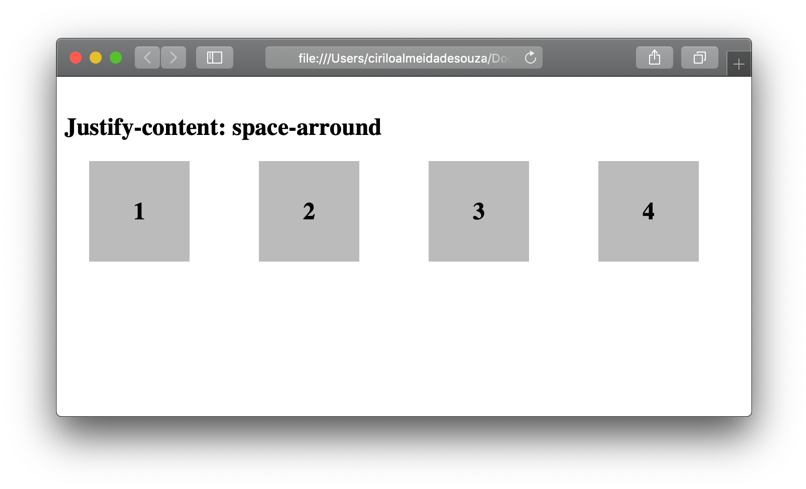
  
  
&nbsp;
  
  
A propriedade justify-content: space-evenly, distribui os elementos uniformemente dentro da linha.

```css
.container13{
    display: flex;
    flex-direction: row;
    flex-wrap: wrap;
    justify-content: space-evenly; 
}
```
  
  
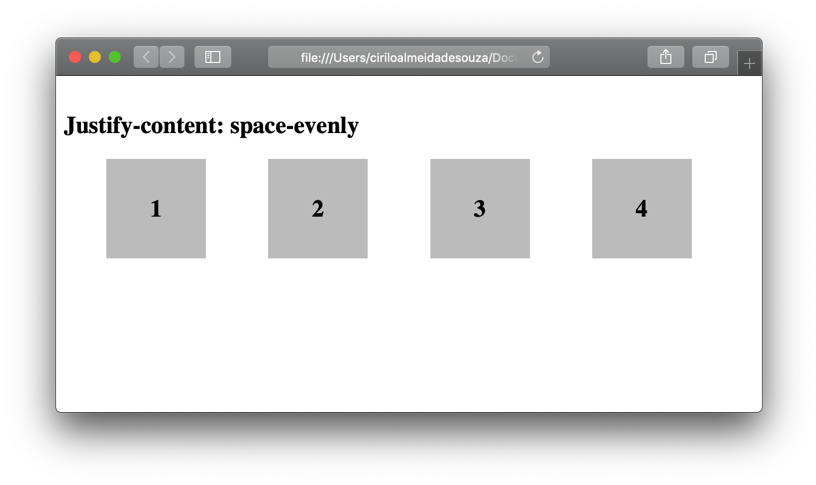
  
  
&nbsp;
  
  
### Align-items:

Alinha os itens dentro do container de acordo com o cross axis (eixo vertical). É como se fosse o justify-content mas  a única diferença é que alinha os itens na vertical.
  
  
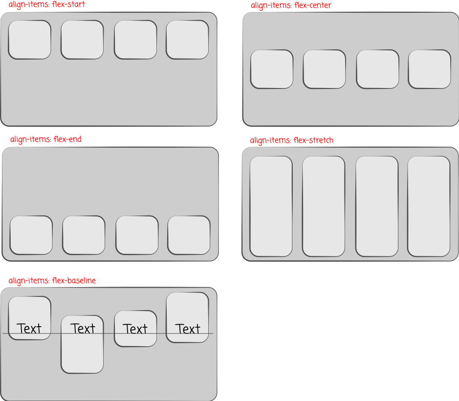
  
  
&nbsp;
  
  
A propriedade align-items: flex-start, alinha todo o conteúdo no topo do container.

```css
.align-items-start{ align-items: flex-start; }
```
  
  
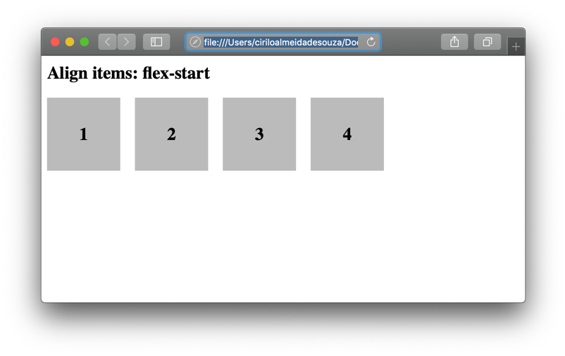

  
  
&nbsp;
  
  
A propriedade align-items: flex-end, alinha os flex itens na parte inferior do container.

```css
.align-items-end{ align-items: flex-end; }
```
  
  

  
  
&nbsp;
  
  
A propriedade align-items: center, alinha os itens no centro vertical do container.

```css
.align-items-center{ align-items: center; }
```
  
  
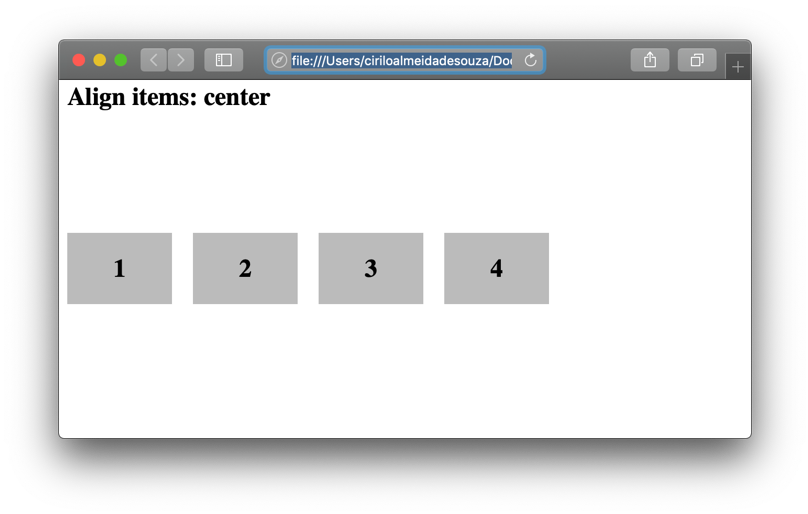
  
  
&nbsp;
  
  
A propriedade align-items: stretch, alonga os itens na vertical para que preencham toda a altura do container.

```css
.align-items-stretch{ align-items: stretch; }
```
  
  
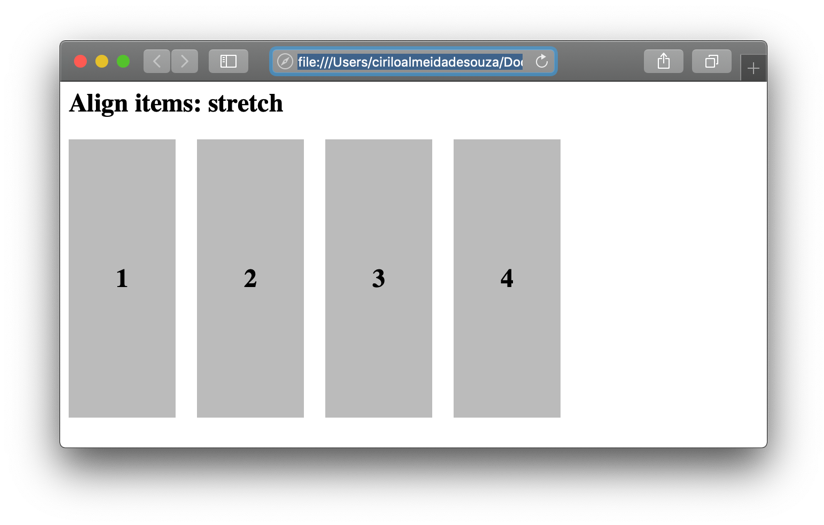
  
  
&nbsp;
  
  
A propriedade align-items: baseline, alinha os itens de acordo com as suas bases.

```css
.align-items-baseline{ align-items: baseline; }
```
  
  
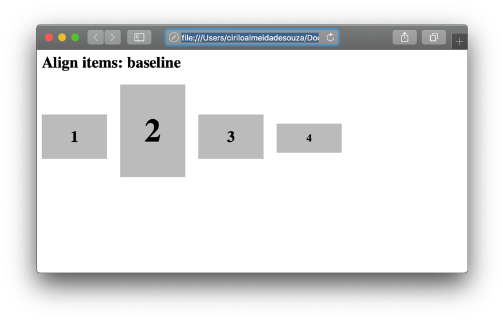
  
  
&nbsp;
  
  
## Flex-items
  
  
&nbsp;
  
  
Os flex-items, são os elementos filhos do container. Algumas propriedades do flex-box alteram somente o seu comportamento. 
  
  
### Order:
  
Por padrão, os flex-items são dispostos na ordem na qual foram escritos no HMTL. Porém, podemos mudar esse comportamento através da propriedade order que controla a ordem na qual os itens aparecem dentro do container.

```html
<h2>Order</h2>
<article class="container ">
    <section class="row align-items-baseline">
        <div style="order: 3">
            <h2>1</h2>
        </div>
        <div style="order: 1">
            <h2>2</h2>
        </div>
        <div style="order: 4">
            <h2>3</h2>
        </div>
        <div style="order: 2">
            <h2>4</h2>
        </div>
    </section>
</article>
```
  
Repare que utilizei o atributo style em cada um dos itens com a propriedade order.
  
  
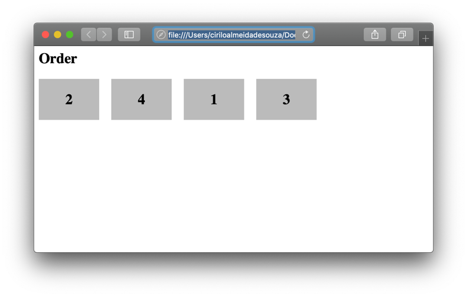
  
  
&nbsp;
  
  
### Flex-grow:

O Flex-grow permite que um item cresça de forma a ocupar um espaço livre dentro do container. Se o valor da propriedade for 1 e todos os itens receberem esta propriedade, o espaço será dividido igualmente entre todos os itens do container. Se apenas um item receber o valor de propriedade 2, este crescerá de forma a ocupar os espaços em branco.

```css
.grow{ flex-grow: 1; }
```
  
  
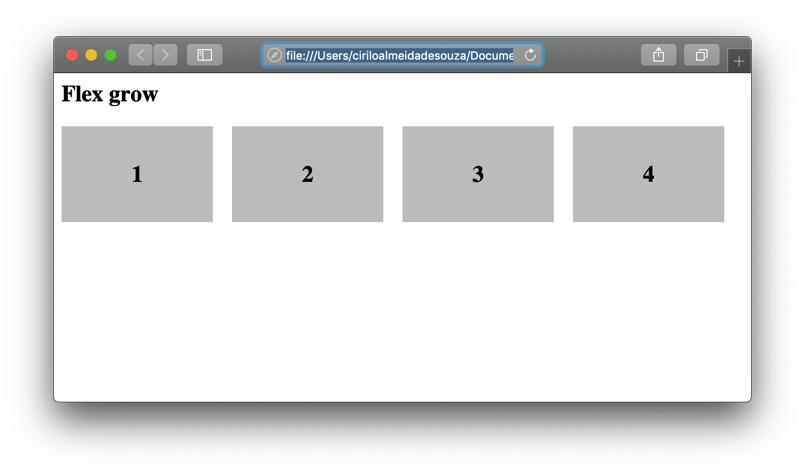
  
  
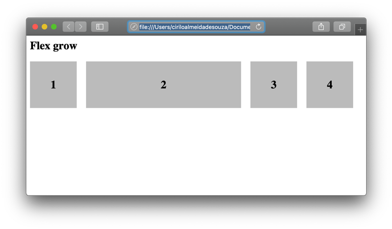
  
  
Números negativos não são aceitos por esta propriedade.
  
  
&nbsp;
  
  
### Flex-shrink:

A propriedade flex-shrink especifica o quanto um elemento irá encolher com relação aos demais itens dentro do container conforme novos itens forem adicionados ou a janela do navegador for redimensionada. O valor 0 mantém o tamanho original do item. 

```css
<h2>Flex-shrink: 0</h2>
<article class="container">
    <section class="row">
        <div>
            <h2>1</h2>
        </div>
        <div style="flex-shrink: 0;">
            <h2>2</h2>
        </div>
        <div>
            <h2>3</h2>
        </div>
        <div>
            <h2>4</h2>
        </div>
        <div>
            <h2>5</h2>
        </div>
        <div>
            <h2>6</h2>
        </div>
        <div>
            <h2>7</h2>
        </div>
    </section>
</article>
```
  
  
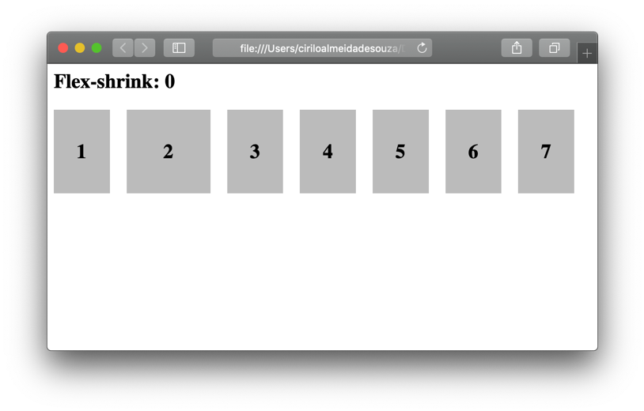
  
  
O valor 1 é o padrão, ou seja, todos os itens terão o seu tamanho reajustado para caberem no container
  
  

  
  
O valor 2 reduz 50%, 3 75% e assim por diante.
  
  

  
  
&nbsp;
  
  
### Flex-basis:

A propriedade flex-bases especifica a largura inicial do item.

```html
<h2>Flex-basis</h2>
<article class="container">
    <section class="row">
        <div>
            <h2>1</h2>
        </div>
        <div style="flex-basis: 200px;">
            <h2>2</h2>
        </div>
        <div>
            <h2>3</h2>
        </div>
        <div>
            <h2>4</h2>
        </div>
    </section>
</article>
```
  
  
&nbsp;
  
  
### Flex:

A propriedade flex, é uma junção do flex-grow, flex-shrink e flex-basis. É uma forma mais curta de declarar estas propriedades no CSS.

```css
.flex{
    flex: 0 0 200px;
}
```

Neste caso, estamos falando que o nosso item não irá crescer nem encolher e a sua largura será de 200px.
  
  


  
  
&nbsp;
  
  
### Align-self:

A propriedade align-self permite sobrescrever o alinhamento padrão configurado com align-items, esta propriedade deve ser aplicada individualmente nos itens do container.

```html
<h2>Align-self</h2>
<article class="container">
    <section class="row">
        <div>
            <h2>1</h2>
        </div>
        <div style="align-self: flex-end">
            <h2>2</h2>
        </div>
        <div>
            <h2>3</h2>
        </div>
        <div>
            <h2>4</h2>
        </div>
    </section>
</article>
```
  
  
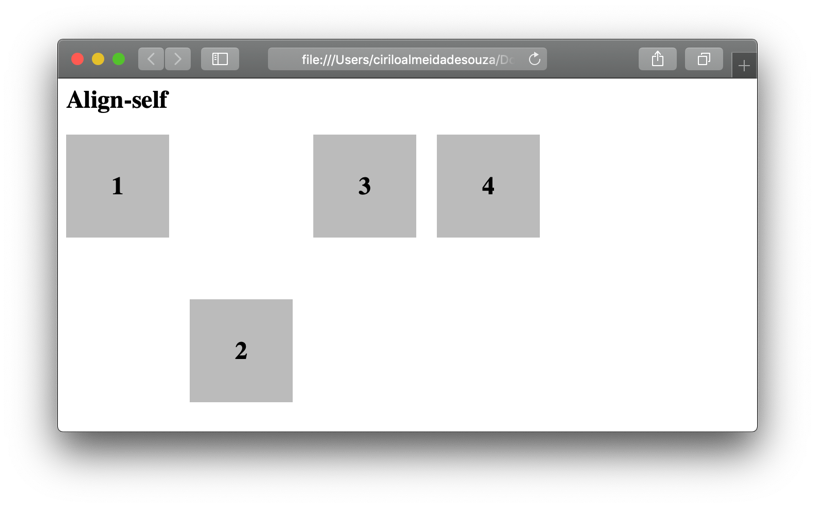
  
  
&nbsp;
  
  
[< Retornar à página principal](../README.md)
  
  
[Ir para a próxima página >](22-Multimidia.md)
