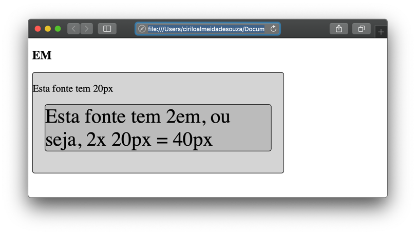
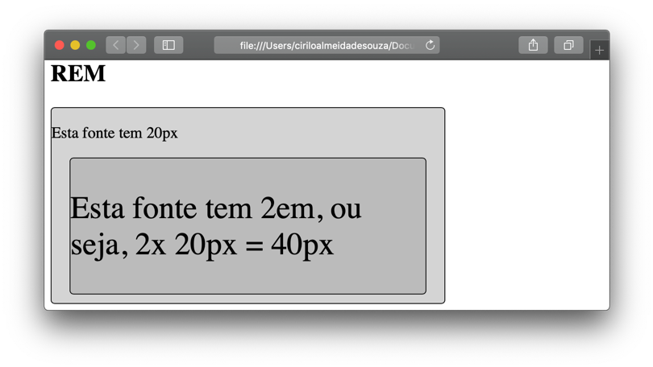

# Medidas relativas
  
  
&nbsp;
  
  
Até agora trabalhamos com as dimensões de altura, largura, fonte, etc em PX. Mas o que significa isso? E qual impacto este tipo de medida gera nas nossas páginas Web já que agora elas serão acessadas a partir de dispositivos diferentes?
Neste capítulo vamos falar um pouco sobre unidades de medida que podemos utilizar no nosso CSS, existem dois tipos de medidas, as absolutas e as relativa

  
  
&nbsp;
  
  
## Medidas absolutas
  
  
&nbsp;
  
  
As medidas absolutas têm esse nome porque são fixas, ou seja, independente do dispositivo no qual a página será exibida, elementos com medidas absolutas permanecerão sempre do mesmo tamanho. Um exemplo de uma medida absoluta são as unidades em PX (pixels), se falarmos que um elemento terá 100px de altura e 100px de largura, ele sempre ocupará esse espaço na tela independentemente do dispositivo.
  
  
&nbsp;
  
  
### Mas o que são pixels?

Ao ampliarmos uma imagem percebemos que ela possui pequenos quadrados coloridos, estes quadradinhos são os pixels. Quando combinados eles geram formas que são as imagens que vemos no nosso dia-a-dia.
  
  

   

  
  
&nbsp;
  
  
### Mais medidas absolutas:
  
Além do PX, temos outras unidades de medidas que também podem ser usadas no nosso CSS, são elas:
  
| Unidade              | Descrição                                                                                                    |
|----------------------|--------------------------------------------------------------------------------------------------------------|
| **CM (Centímetros)**     | O centímetro é uma unidade de medida do sistema métrico, equivale a 1 centésimo de 1000 metros.              |
| **MM (milímetros)**      | O centímetro é uma unidade de medida do sistema métrico, equivale a 1 milésimo de 1000 metros.               |
| **IN (POLEGADAS)**       | É uma unidade de comprimento usada no sistema imperial de medidas. Uma polegada equivale a 2,54 centímetros. |
| **PT (PONTOS)**          | Especifica o número de pontos individuais que existem em uma polegada.                                       |
| **PC (PICAS ou PAICAS)** | Foi uma das primeiras unidades de medidas tipográficas criadas, equivale a 4,23 milímetros.                  |
  
  
&nbsp;
  
  
## Medidas relativas
  
  
&nbsp;
  
  
As medidas relativas, são relativas a outros elementos dentro da página. Unidades relativas são boas, pois fazem os elementos se ajustarem de acordo com o tamanho das telas nos quais são exibidos. Por exemplo, se temos um viewport (falaremos sobre ele mais adiante) de 1920px de largura, e configuramos um container para ocupar 80% de largura, este container terá 1536px, mas se a mesma página for exibida em um iPhone 5s ela terá 256px de largura.
Isso acontece porque a largura do viewport de um iPhone é de 320px, bem menor que de um desktop.
  
  
&nbsp;
  
  
## EM:
  
Relativo ao tamanho da fonte do elemento pai, por exemplo: Se o elemento pai tem um font-size: 20px e o elemento filho um font-size: 2em a fonte do filho será 2x maior que a fonte do pai, ou seja, ela terá 40px.
  
  
**HTML**
```html
<h2>EM</h2>
<div class="elemento-pai">
    <p>Esta fonte tem 20px</p>
    <div class="elemento-filho">
        <p>Esta fonte tem 2em, ou seja, 2x 20px = 40px</p>
    </div>
</div>
```
  
  
**CSS**
```css
.elemento-pai{font-size: 20px;}

.elemento-filho{font-size: 2em;}
```
  
  

  
  
&nbsp;
  
  
### REM:
  
Também é relativo ao tamanho da fonte da página Web. Por padrão, o tamanho da fonte dos maioria dos navegadores é de 16px, porém esse valor pode ser alterado pelo usuário a qualquer momento.
Uma vez que o usuário altere o tamanho da fonte do navegador, todos os elementos que possuem medidas em REM serão alterados também. Mas nós também podemos alterar o tamanho padrão da fonte do navegador, basta atribuirmos a propriedade font-size diretamente no seletor body.

```css
body{font-size: 20px}

.elemento-filho{font-size: 2em;}
```
  
  

  
  
&nbsp;
  
  
### % (Porcentagem):
  
É relativo ao elemento pai, que pode ser a própria página ou um elemento dentro dela. Por exemplo, se a largura do viewport for de 1440px, e se criarmos um elemento com um width: 50%  a largura será equivalente a 720px. Se dentro dele criarmos um elemento filho com o width: 50% este terá uma largura de 360px, porque sua medida se refere ao elemento pai que possui 720px de largura.
  
  
```css
.elemento-pai{width: 50%;}

.elemento-filho{width: 50%;}
```
  
  

  
  
&nbsp;
  
  
### Outras medidas relativas:
| Unidade     | Descrição                                                                                                                                                                                                                                   |
|-------------|---------------------------------------------------------------------------------------------------------------------------------------------------------------------------------------------------------------------------------------------|
| **CH**        | O CH vem de character (caractere em português), ou seja, ele é relativo à largura do caractere zero “0” da fonte que está sendo utilizada na página Web.                                                                                    |
| **VW**        | É relativo à largura do viewport, é equivalente a 1% da largura.                                                                                                                                                                            |
| **VH**          | É relativo à altura do viewport, é equivalente a 1% da altura.                                                                                                                                                                              |
| **VMIN e VMAX** | É relativo ao tamanho mínimo da largura e altura respectivamente. Se um navegador tiver uma largura de 1440px e uma altura de 920px, e configurarmos o width: 1vmax seria equivalente a 14,4px e o height: 1vmin seria equivalente a 9,2px. |
  
  
&nbsp;
  
  
[< Retornar à página principal](../README.md)
  
  
[Ir para a próxima página >](18-O-que-e-um-View-Port.md)
