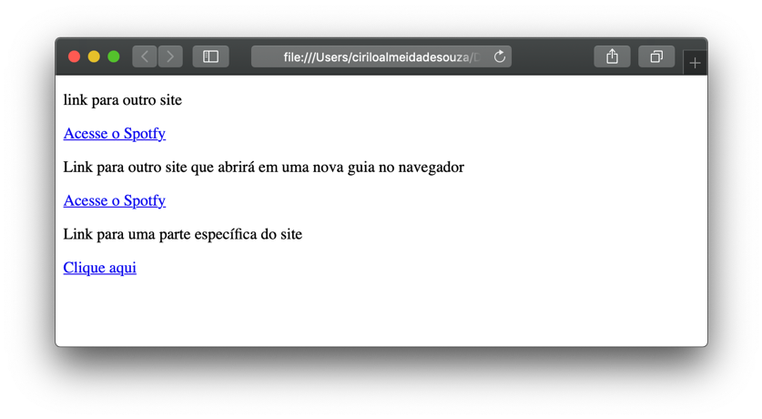

# O que são links?
  
  
&nbsp;
  
  
Os links são muito importantes na Web porque conectam as páginas e é isso que dá o sentido a Internet. Os links indicados pelo elemento \<a\> são âncoras que podem apontar para sites externos, páginas no mesmo site ou até mesmo para uma parte determinada do próprio site.
Ele utiliza o atributo href para indicar para onde o link deve ir.
  
  
&nbsp;
  
  
## Links de página
Para apontar para um site externo, no valor do atributo href coloque o link para o site no qual deseja que ele aponte.

```
<hmtl>
  <body>
      <a href="https://www.spotify.com/br/">Acesse o Spotfy</a>
  </body>
</hmtl>
```
  
  
&nbsp;
  
  
### Link para páginas do mesmo site:
Basta colocar o valor do atributo href com caminho da página para o qual deseja apontar.

```
<hmtl>
  <body>
      <a href="http://www.sp.senai.br/" target="_blank">Acesse o Spotfy</a>
  </body>
</hmtl>
```
  
  
&nbsp;
  
  
### Link para uma sessão do site: 
No valor do atributo href basta inserir o id da sessão para qual o link deve ser ancorado.

```
<hmtl>
  <body>
      <a href="#fale-conosco">Fale conosco</a>
  </body>
</hmtl>
```

Repare que o texto muda para a cor azul e fica sublinhado, esta é indicação do navegador que esse texto se trata de um link.


  
  
&nbsp;
  
  
### Links de e-mail:
Sinceramente não recomendo utilizar! Porque quando clicamos nele ele abre o Outlook do Windows ou qualquer outra aplicação de correio eletrônico padrão instalada no dispositivo no qual estamos acessando o site. 

```
<hmtl>
  <body>
      <a href="mailto:fulano@email.com">E-mail do Fulano</a>
  </body>
</hmtl>
```
  
  
&nbsp;
  
  
### Abrindo link em página diferente:
Pode não ser uma boa ideia manda o usuário para uma página externa utilizando a mesma guia do navegador, porque ele pode simplesmente nunca mais voltar ao seu site! E pode acreditar isso acontece com bastante frequência. Para evitar perder um possível cliente utilizamos o atributo target=”_blank”. 
Ao clicar sobre o link, o navegador abrirá uma nova guia com o site de destino.

```
<hmtl>
  <body>
      <a href="www.sp.senai.br" target="_blank">Abrindo link em uma nova guia</a>
  </body>
</hmtl>
```
  
  
&nbsp;
  
  
[< Retornar à página principal](../README.md)
