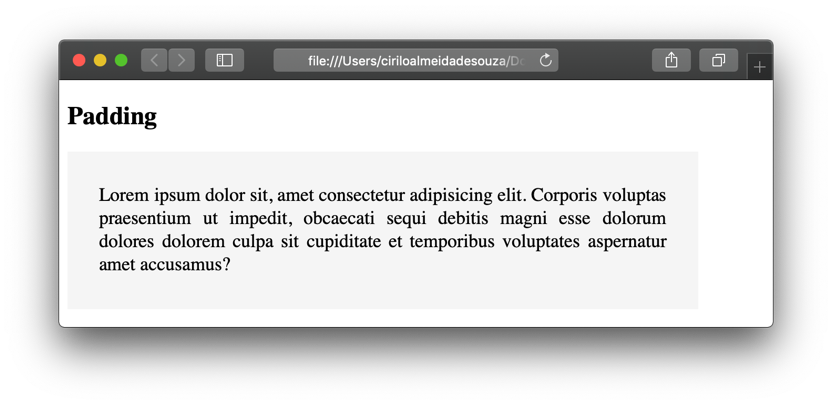

 # Caixas e mais caixas
   
  
&nbsp;
  
  
Você vai perceber com o passar do tempo que tudo no HTML e no CSS se resume a caixas. Muitos elementos HTML podem ser pensados desta forma, onde através do CSS conseguimos alterar seu tamanho, cor, posição, etc.
Cada uma dessas caixas ocupam um espaço dentro da página Web e possui propriedades que podem ser alteradas.

  
  
&nbsp;
  
  

## Elementos em bloco X elementos em linha
  
  
Há duas categorias importantes no HTML, que você precisa conhecer — elementos em bloco e elementos linha.

  
  
&nbsp;
  
  
### Elementos em bloco:
Formam um bloco visível na página. Eles aparecerão em uma nova linha logo após qualquer elemento que venha antes dele, e qualquer conteúdo depois de um elemento em bloco também aparecerá em uma nova linha. Elementos em bloco geralmente são elementos estruturais na página que representam, por exemplo: parágrafos, listas, menus de navegação, rodapés etc. Um elemento em bloco não seria aninhado dentro de um elemento inline, mas pode ser aninhado dentro de outro elemento em bloco.
Um exemplo de elemento de bloco é o \<div\>, ele é um container que serve para agrupar um conjunto de tags isso melhora a legibilidade do nosso código HTML.

```
<html>
  <body>
    <div>
      <p>Primeiro parágrafo</p>
      <p><em>Segundo parágrafo</em></p>
      <p>Terceiro parágrafo</p>
    </div>
  </body>
</html>
```
  
Os elementos de bloco possuem uma margem, uma borda e um pading.
  
  
&nbsp;
  
  

  
  
&nbsp;
  
  
**Padding:** É o espaço entre o conteúdo e a borda do elemento;

  
  
  
**Margin:** É o espaço externo a partir da borda de uma caixa;

  
  
**Border:** É a linha sólida do lado de fora ao redor da caixa;
  
  
&nbsp;
  
  
### Elementos inline (na linha):
São aqueles que estão contidos dentro de elementos em bloco, envolvem apenas pequenas partes do conteúdo do documento e não parágrafos inteiros ou agrupamentos de conteúdo. Um elemento inline não fará com que uma nova linha apareça no documento: os elementos inline geralmente aparecem dentro de um parágrafo de texto, por exemplo: um elemento \<a\>  (hyperlink) ou elementos de ênfase como \<em\> ou \<strong\>.
  
```
<html>
  <body>
      <p>
          <strong>Lorem ipsum dolor sit amet consectetur adipisicing elit.</strong> Eos corrupti distinctio consequuntur dolore sapiente rem <em>in odio facere hic nisi temporibus aut a,</em> asperiores repudiandae ipsum nihil esse veritatis totam.
      </p>
  </body>
</html>
```
  
  
&nbsp;
  
  
### Transformando elemento de linha em bloco:
Podemos empacotar os elementos de linha dentro de um elemento especial chamado \<span\>, o \<span\> nos permite agrupar os elementos de linha e aplicar um estilo ao elemento dentro dele como de fosse um elemento de bloco.
  
```
<html>
    <body>
        <p>
            Lorem ipsum dolor sit amet <span style="color: red">consectetur</span> adipisicing elit. Explicabo, dolor reprehenderit libero nulla architecto repellat impedit voluptatum temporibus tempora veritatis, eius ducimus sunt. Provident quaerat quibusdam, minus error perferendis ipsum!
        </p>
    </body>
</html>
```
  
  
&nbsp;
  
  

[< Retornar à página principal](../README.md)
