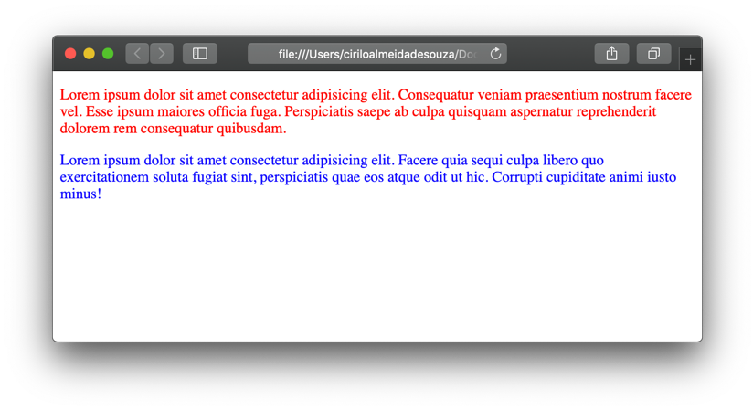
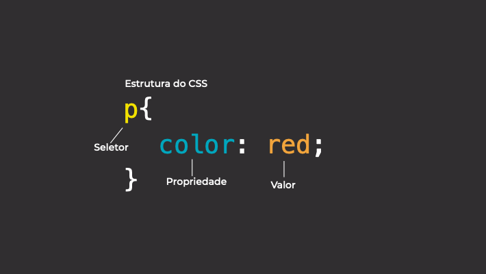
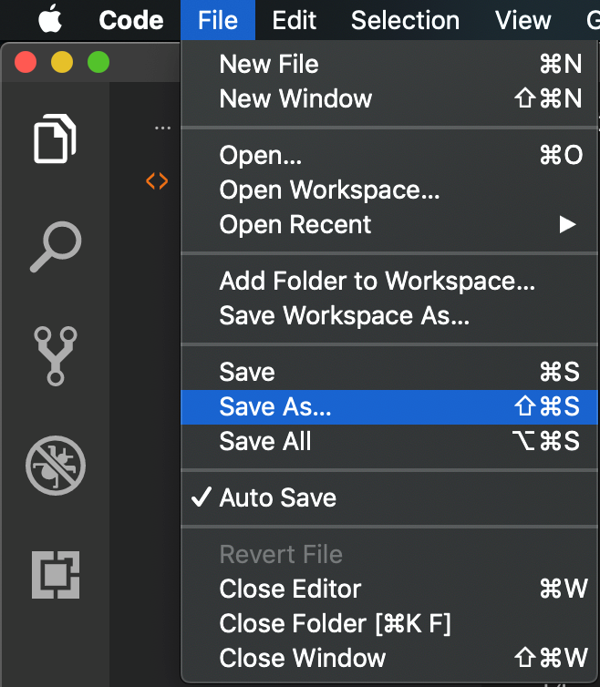

# O que é CSS?
  
  
CSS significa Cascading Style Sheet, tá bom… isso não ajudou muito né?  ¯\\\_(ツ)\_/¯.
  
  
Assim como o HTML, o CSS também não é uma linguagem de programação, mas sim uma folha de estilos. Ele serve para informar ao navegador como os elementos devem ser apresentados na tela, papel, ou qualquer outro meio no qual a página possa ser vista. Ele nos ajuda a economizar um monte de trabalho porque podemos usar o mesmo estilo para vários elementos diferentes.
O estilo pode ser adicionado de três formas, in-line (no próprio elemento HTML), interno e externo.
  
  
&nbsp;
  
  
### Estilo in-line:
O estilo é aplicado no próprio elemento HTML e serve apenas para aquele elemento. 

```
<html>
  <body>
      <p style="color: red;">
          Lorem ipsum dolor sit amet consectetur adipisicing elit. Consequatur veniam praesentium nostrum facere vel. Esse ipsum maiores officia fuga. Perspiciatis saepe ab culpa quisquam aspernatur reprehenderit dolorem rem consequatur quibusdam.
      </p>
      <p style="color: blue;">
          Lorem ipsum dolor sit amet consectetur adipisicing elit. Facere quia sequi culpa libero quo exercitationem soluta fugiat sint, perspiciatis quae eos atque odit ut hic. Corrupti cupiditate animi iusto minus!
      </p>
  </body>
</html>
```
  
  

  
  
&nbsp;
  
  
### Estilo interno:
É aplicado através do elemento <style> dentro da página HTML.
  
```
<html>
  <head>
      <style>
          p{ color: green; }
      </style>
  </head>
  <body>
      <p>
          Lorem ipsum dolor sit amet consectetur adipisicing elit. Consequatur veniam praesentium nostrum facere vel. Esse ipsum maiores officia fuga. Perspiciatis saepe ab culpa quisquam aspernatur reprehenderit dolorem rem consequatur quibusdam.
      </p>
  </body>
</html>
```
  
  

  
  
Particularmente não recomendo aplicar estilos in-line e interno, porque conforme as páginas crescem se torna muito difícil dar manutenção neste tipo de código.
  
  
&nbsp;
  
  
### Estilo externo:
Para utilizarmos um arquivo CSS externo basta inserir elemento \<link\> dentro de \<head\> e no atributo rel informamos o valor “stylesheet” ou seja, uma folha de estilos. Não confunda o elemento \<link\> com as âncoras \<a\> que falamos agora a pouco.
Para finalizar, basta atribuir ao atributo href a localização do arquivo CSS.

```
<html>
  <head>
      <link rel="stylesheet" href="style.css">
  </head>
</html>
```
  
  
&nbsp;
  
  
## Anatomia do seletor CSS
  
  

  
  
### Seletores (Selector):
Os seletores servem para selecionar os elementos HTML que queremos aplicar um estilo, existem diferentes tipos de seletores, por hora, veremos apenas três deles, seletor de elemento, ID e de classe.
  
  
| Nome do Seletor      | O que ele seleciona                         |
| ----                 | ------                                      |
| Seletor de elemento  | Seleciona todos os elementos HTML da página | 
| Seletor de ID        | Seleciona um elemento específico através do seu atributo id. O ID é aplicado através do uso da hashtag # no arquivo CSS |
| Seletor de classe    | Aplica o estilo a todos os elementos que utilizem a classe. A classe é aplicada com o uso do ponto . no arquivo CSS |
  
  
Um seletor pode conter várias propriedades, cada uma deve ser separada por um ponto e vírgula “;” o navegador não faz distinção se as propriedades forem escritas na mesma linha ou em linhas diferentes desde que cada uma seja separada por um ponto e vírgula. O que delimita o início e o final do seletor são as chaves “{ }”.

```
<html>
  <style>
    #paragrafo{
        color: red;
        font-size: 1em;
    }
  </style>
```

É o mesmo que:

```
<html>
  <style>
    #paragrafo{color: red;font-size: 1em;}
  </style>
```
  
  
&nbsp;
  
  
### Propriedade (Property):
Especifica qual propriedade do elemento HTML selecionado queremos aplicar um estilo, no exemplo acima a propriedade que está sendo alterada é a cor da fonte color e o tamanho dela font-size. 
  
  
&nbsp;
  
  
### Valor (Property Value):
É o valor que queremos aplicar a propriedade, neste caso queremos que a cor da fonte seja vermelha, por tanto, o valor deve der red (vermelho em inglês).
  
  
A propriedade e o valor são separados por dois pontos “:”  

```
color: red;
```
  
  
É possível selecionar vários elementos HTML de uma só vez, para isso basta separar os seletores com uma vírgula

```
<head>
  <style>
    #sessao1, #sessao2{
        color: red;
    }
  </style>
</head>
```
  
  
&nbsp;
  
  

## Criando arquivo CSS
  
  
Para criarmos um arquivo CSS basta clicar em File/Save as… e salvar o arquivo com uma extensão .CSS
  
  

  
  

  
  

[< Retornar à página principal](../README.md)
  
  
[Ir para a próxima página >](9-Aplicando-estilo-com-CSS.md)
