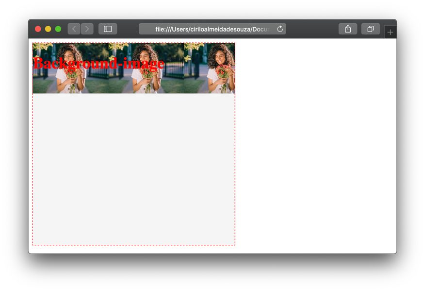
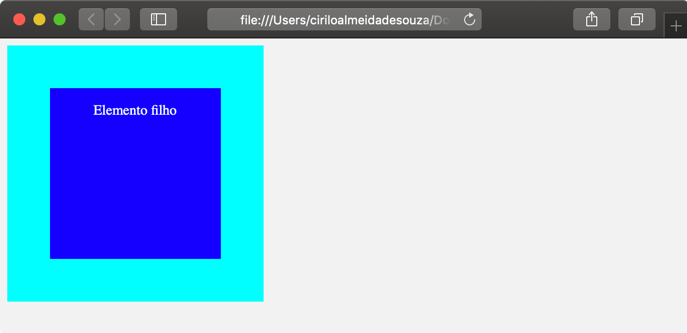

# Aplicando estilo com CSS
  
  
&nbsp;
  
  
Nós já vimos o que são os seletores de elemento, id e classes. Agora vamos conhecer algumas propriedades CSS que nos ajudarão a aplicar um estilo legal às nossas páginas HTML.
  
  
&nbsp;
  
  
## Cores
  
  
O CSS suporta 140 nomes de cores padrão, para todas as outras podemos utilizar os códigos RGB ou Hexadecimal. Para consultar a lista de cores padrão acesse: 
[W3Schools](https://www.w3schools.com/colors/colors_names.asp)
  
  
&nbsp;
  
  
### Cor de elementos de texto:
A mesma propriedade vale para os elementos de lista, links, parágrafos e cabeçalhos basta alterarmos o seletor para o elemento que deseja alterar.
  
```
<style>
  p{ color: white; }

  a{ color: pink; }

  h1{ color: darkblue; }
</style>
```
  
  
&nbsp;
  
  
### Cor de fundo:

```
<style>
  div{ background-color: black; }
</style>
```
  
  
&nbsp;
  
  
### Cor de borda:
Como vimos anteriormente, os elementos de bloco possuem bordas, e podemos estiliza-las utilizando a propriedade border-color do CSS.
```
<style>
  div{ border-color: aqua; }
</style>
```
  
  
&nbsp;
  
  
### Cor em RBG:
As cores RBG são o resultado da junção de três cores primárias o vermelho (Red), o verde (Green) e o Azul (Blue). Seus valores vão de 0 a 255 para cada canal de cor, ou seja, podemos ter diversas combinações de cores manipulando os canais.

```
<style>
  div{ background-color: RGB (255, 130, 71); }
</style>
```
  
  
Cada número separado por vírgula representa um canal de cor, se alterarmos os valores teremos uma cor diferente. O RGB também nos permite aplicar transparência a cor, é o que chamamos de RGBA, o A representa o canal Alfa que define a opacidade da cor seu valor vai de 0 a 1 sendo 0 totalmente transparente e 1 totalmente opaco.

```
<style>
  #bloco1{
    background-color: rgba(0, 255, 255, 0);
    color: black;
}

#bloco2{
    background-color: rgba(0, 255, 255, 0.25);
}

#bloco3{
    background-color: rgba(0, 255, 255, 0.5);
}

#bloco4{
    background-color: rgba(0, 255, 255, 1);
}

</style>
```
  
  

  
  
&nbsp;
  
  
## Backgrounds
Os backgrounds ficam atrás dos elementos como se estivessem em segundo plano, podemos aplicar imagens, cores e vídeos em um background.
  
  
### Cor de fundo:

```
<style>
  div{ background-color: black; }
</style>
```
  
  
&nbsp;
  
  
### Imagens como fundo:

```
<style>
  div{ background-image: url('mulher.jpg'); }
</style>
```
  
  

  
  
&nbsp;
  
  
### Repetição de imagens:
As imagens de background podem se repetir nos eixos X (horizontal) e Y (vertical), se uma imagem é pequena para um elemento, ela será repetida por padrão em ambos os eixos. Porém podemos mudar esse comportamento com as propriedades background-repeat: repeat-x e background-repeat: repeat-y. 
  
  
```
<style>
  div{ 
    background-image: url('mulher.jpg');
    background-repeat: repeat-x;
 }
</style>
```
  
  

  
  
```
<style>
  div{ 
    background-image: url('mulher.jpg');
    background-repeat: repeat-y;
 }
</style>
```
  
  

  
  
Podemos também bloquear a repetição das imagens com o valor de propriedade no-repeat.

```
<style>
  div{ 
    background-image: url('mulher.jpg');
    background-repeat: no-repeat;
 }
</style>
```
  
  

  
  
&nbsp;
  
  
## Bordas

Como já falamos os elementos de bloco possuem bordas, que o delimitam. Também podemos aplicar estilo a elas com a propriedade border.
  
  
&nbsp;
  
  
### Estilo da borda:
Uma borda pode ser solida, tracejada, pontilhada, ou uma mescla de estilos. Podemos inserir até 4 estilos de borda, sendo que cada um será aplicado a uma borda iniciando pela superior.

```
<style>
  div{ 
    border-width: 2px;
    border-color: red;
    border-style: solid dotted dashed solid;
 }
</style>
```
  
  

  
  
| Valor  | O que faz                                                  |
|--------|------------------------------------------------------------|
| Double | Cria uma borda dupla                                       |
| Groove | Cria um efeito 3d na borda, como se fosse um vinco externo |
| Ridge  | Cria um efeito 3d na borda                                 |
| Inset  | Cria um efeito 3d na borda                                 |
| Outset | Cria um efeito 3d na borda                                 |
| Hidden | Borda oculta                                               |
  
  
&nbsp;
  
  
### Cor da borda:

```
<style>
  div{ border-color: black; }
</style>
```
  
  
&nbsp;
  
  
### Sem borda:


```
<style>
  div{ border-color: none; }
</style>
```
  
  
&nbsp;
  
  
### Largura da borda:

```
<style>
  div{ border-width: 2px; }
</style>
```
  
  
&nbsp;
  
  
### Bordas arredondadas:

```
<style>
  div{ border-radius: 10px; }
</style>
```
  
  

  
  
Podemos também uma borda para apenas um dos lados do nosso elemento, como as propriedades border-top, border-botom, border-left e border-right

```
<style>
  #bloco1{ border-top: 2px solid black; }

  #bloco2{ border-bottom: 2px solid black; }

  #bloco3{ border-left: 2px solid black; }

  #bloco4{ border-right: 2px solid black; }
</style>
```
  
  

  
  
Perceba que aplicamos vários valores a propriedade border, o CSS nos permite fazer isso para economizarmos linhas de cógido.
  
  
&nbsp;
  
  
## Margens

A margem é o espaçamento externo de um elemento de bloco para outro. Assim como o border, podemos informar até quatro valores para a propriedade margin. Os valores serão aplicados da seguinte forma: margem superior, direita, inferior e esquerda.

```
<style>
  div{ margin: 10px 20px 10px 20px; }
</style>
```
  
  
Se quisermos aplicar os mesmos valores nas margens superior e inferior, mas valores diferentes nas margens da esquerda e direita, basta aplicarmos dois valores à propriedade.

```
<style>
  div{ margin: 10px 20px; }
</style>
```
  
  
Ou podemos utilizar os seletores

```
<style>
  div{
    margin-top: 10px;
    margin-bottom: 10px;
    margin-left: 20px;
    margin-right: 20px
  }
</style>
```
  
  

  
  
&nbsp;
  
  
## Paddins

Diferente do margin, o padding é a distância entre os elementos filhos para a borda interna do elemento pai.
  
  

  
  
O elemento pai possui 300px de altura e largura, já o elemento filho possui 200px de altura e largura. Aplicamos um padding no elemento pai de 50px isso dá a impressão de que o elemento filho está centralizado dentro do pai.

  
  
&nbsp;
  
  
[< Retornar à página principal](../README.md)
  
  
[Ir para a próxima página >](10-Float.md)
